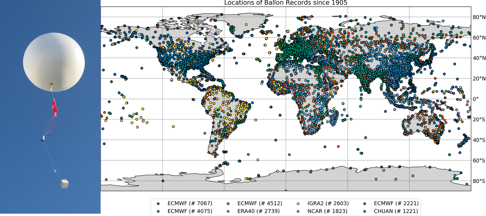

# CEUAS
Copernicus Climate Change - Early Upper Air Service

Service Contract C3S 311c Lot2

Collaborators:

* L. Haimberger
* M. Blaschek
* F. Ambrogi
* U. Voggenberger

Status: running
Final: 06-2021
Last Update: 12-2020

## Harvest
This contains information on how to read the data from different data sources and produce a version that can be merged together.
- read NCAR, IGRA, MARS ODB
- convert to NetCDF4

## Uncertainties
This contains information on how to calculate uncertainty estimates following the `de Desrozier` method employing first guess and analysis departures from ERA5 reanalysis. More information is given in the Deliverables (DC3S311c_Lot2.2.1.1, DC3S311c_Lot2.2.2.1)

## CDS-Backend
This contains information on the virtual machine service server hosted by the CDS. Information on how to access the backend is only for developers, ot users.

## CDS-Frontend
This contains information on the CDS frontend and how data can be requested via the [CDS api](https://cds.climate.copernicus.eu/api-how-to) or the [CDS website](https://sis-dev.climate.copernicus.eu/cdsapp#!/dataset/insitu-comprehensive-upper-air-observation-network?tab=overview).

## Adjust
This contains information on how to run the homogenisation software on CDM compliant files and is intended for experimental use. Users can change test and detection parameters to their needs. The expert guided test and detection parameters are given allready in the CDM files retrieved via the C3S Store.

## Merge
This contains information on how the merging from different data sources is done and how profiles are selected and documented.

## Postprocess
This contains information on how some duplicates are removed and post processing (variables, metadata) is conducted.

## Intercomparisons
This contains information on how to request and use data from intercomparison campaigns.

## Resort
This contains information on how to resort the CDM NetCDF files in order to improve performance of the cds-backend.

## Gridding
This contains information on how to use the dataset and produce a monthly gridded version.

## Testing
This contains information on how to run a test suite on the cds-frontend/cds-backend

## Quality control
This contains information on how the quality control is defined and conducted.
